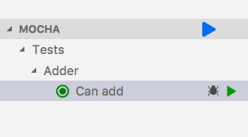

# typescript-primer

Minimalist boiler plate for Typescript/VSCode project to get a productive environment off the ground in a single clone.

It will:

- build 🏗️
- run 🏃
- tests 🧪
- lints ✨

## Pre-requisites

```
npm -v
6.9.0

node --version
v10.15.0
```

## Install

```sh
git clone https://github.com/agonzalezjr/typescript-primer.git
cd typescript-primer
npm i
code . # open VSCode
```

## Usage from CLI

```sh
npm start     # runs index.ts
npm test      # runs all unit tests
npm run lint  # runs the linter
```

## Usage from VSCode

You can easily get the recommended extensions with the **Extensions: Show Recommended Extensions** command in VSCode.

### Debug/Run

To Debug/Run the main code, use the `Launch Program` launch configuration.

### Debug tests

To Debug/Run the tests, use the `Launch Tests` launch config.

Alternatively, install the [Mocha sidebar extension](https://marketplace.visualstudio.com/items?itemName=maty.vscode-mocha-sidebar) to debug and run tests right from VSCode.



### TDD

Install the [Node TDD extension](https://marketplace.visualstudio.com/items?itemName=prashaantt.node-tdd). Your code will be built/tested automatically whenever project is saved.


### Linting

Code will be auto-fixed on Save when possible. The linter can be run with command > Run task > npm: lint

## Project structure

```sh
# source
src/           -> put TS code here
src/index.ts   -> main
test/          -> put TS tests here

# settings/config
.eslintrc.js   -> ESLint config
.prettierrc.js -> Prettier config
tsconfig.json  -> TS compiler settings

# output
dist/          -> compiled JS code will be here
test-report/   -> test report will be here
```
